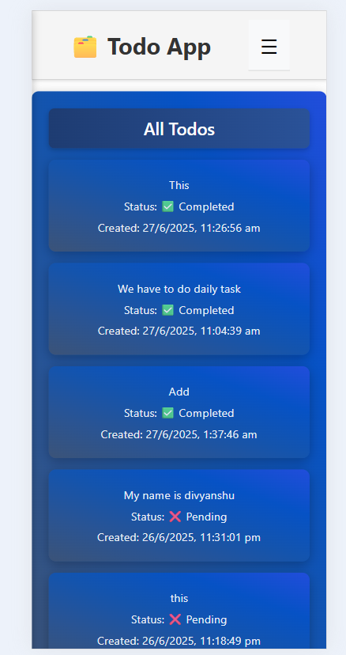

# 📝 Todo App

A simple Todo application built with [React](https://reactjs.org/) that allows users to manage their tasks efficiently.

## 🚀 Features

- Add new todos
- Mark todos as completed
- Delete todos
- View completed/incomplete todos
- Responsive design

## 📦 Tech Stack

- React
- Firebase 
- CSS Modules
- React Router

## Screenshot





## 🔧 Installation

```bash
git clone https://github.com/Divyanshu-Mahajan/todo-app.git
cd todo-app
npm install
npm start

```